# BitTE Optimization Project

## Overview

We have managed to develop an application called *PackApp* that assists travellers with the task of loading a suitcase.

Below you can find a detailed description of this repository's contents and its intended use.

---

## Compilation

We have chosen to work with Maven as a compilation and packing/testing tool.

In order to compile the program the following command is used:

```bash
mvn clean install
```

This command will clean the target directory and then compile and package the application.

Please use it twice. The second time the insertions of the database are commited

---

## Execution

It is quite simpe to execute the program, access the target directory and then run the following command through the terminal:

```bash
java -jar BitTE-1.0-SNAPSHOT.jar
```

The program will be launched immediately. In addition, a folder named sqlite will be created under the C: driver of the user's computer;

this folder contains all database elements and can be viewed for extra information.

---

## Usage Guide

Below you can find a description of the standard program use.

- When the app is launched, the user is prompted to input the dimension (length, width, height) of their suitcase.
- Afterwards, the app requests an input from the user that concerns some essential items
  
  that the user requires to be packed (such as a shirt or hoodie or any accessories).
  
- The app makes sure to ask for the user's sex so that it can select the appropriate items accordingly.
- This process is then continued for as long as the user needs until they have added all essential items.
- The same process goes on for any non-essential items the user may need.
- When the user is satisfied with their choices and exits the selection process,

  the app uses optimization methods to present the combination of items that can fit the remainder of space

  while already having packed all aforementioned items beforehand.

---

## Repository Layout

The project follows the standard Maven directory structure:

```
project-root/
├── src/
│   ├── main/
│   │   ├── java/          
│   │   ├── resources/  
│   └── test/
│       ├── java/         
│       ├── resources/    
├── pom.xml                 
└── target/ 
```

We Have also added some external files for the purpose of static code analysis

and github actions such as automatic pull request reviewer assignment, as well as 

the get-pip.py file that eases the package download process in terminal use.

---

## UML Diagram

```mermaid
classDiagram
direction TB

%% Group AppStart and Core Components
subgraph Application Core
    class AppStart {
        +void main(String[] args)
    }
    AppStart --> DatabaseTableCreation : instantiates
    AppStart --> DatabaseConnection : uses
    AppStart --> ResultPresenter : instantiates
    AppStart --> CreateSuitcase : instantiates
    AppStart --> EssentialItems : instantiates
    AppStart --> NonEssentialItems : instantiates
    AppStart --> SpaceOptimizer : uses
end

%% Group Database Classes
subgraph Database
    class DatabaseConnection {
        -static final String DB_PATH
        -static final String DB_FILE
        +static Connection getConnection()
    }
    class DatabaseTableCreation {
        -String url
        -void initializeDatabase()
    }
    DatabaseTableCreation --> DatabaseConnection : uses
end

%% Group Item Classes
subgraph Items
    class PackingItem {
        #int value
        #String type
        #char size
        #final char gender
        +String getType()
        +int getValue()
        +char getSize()
        +char getGender()
        +abstract double getWeight()
        +abstract double getVolume()
        +String toString()
    }
    PackingItem <|-- Clothing
    PackingItem <|-- Extras

    class Clothing {
        -double fetchAttributeFromDB()
        -double executeQuery()
        +double getWeight()
        +double getVolume()
        +String toString()
    }

    class Extras {
        -double fetchAttributeFromDB()
        -double executeQuery()
        +double getWeight()
        +double getVolume()
        +String toString()
    }
end

%% Group Handlers
subgraph Handlers
    class MenuHandler {
        -static String[] commonClothing
        -static String[] maleClothing
        -static String[] femaleClothing
        -static String[] extraItems
        +static void chooseItemType()
        +static void showStartingMenu()
        +static void showNonEssentialItemsMenu()
        +static void showClothingMenu(char)
        +static void showExtrasMenu()
        +static void showItems(ArrayList~PackingItem~)
    }

    class ItemInputHandler {
        +static int setTypeOfItem(Scanner)
        +static char setGender(Scanner)
        +static char setSize(Scanner)
        +static void inputItem(ArrayList~PackingItem~, int, String, char, char)
    }

    class ItemDeletionHandler {
        +static void deleteItem(ArrayList~PackingItem~, Scanner)
    }
end

%% Group Constraints and Optimization
subgraph Constraints and Optimization
    class EssentialConstraints {
        +static final int BOTH_CONSTRAINTS_RESPECTED
        +static final int ONLY_WEIGHT_CONSTRAINT_RESPECTED
        +static final int ONLY_VOLUME_CONSTRAINT_RESPECTED
        +static final int NO_CONSTRAINTS_RESPECTED
        +static int checkConstraints(ArrayList~PackingItem~, double, double)
        +static void showConstraintFeedback(ArrayList~PackingItem~, int, double, double)
        +static boolean fixConstraints(ArrayList~PackingItem~, Scanner, double, double)
    }

    class SpaceOptimizer {
        -IntVar[] binaryVars
        +Model createModel(ArrayList~PackingItem~, int, int)
        +void addConstraints(Model, IntVar[], IntVar[], int, int)
        +ArrayList~PackingItem~ solveModel(ArrayList~PackingItem~, double, double)
    }
    SpaceOptimizer --> PackingItem : uses
end

%% Group Essential and Non-Essential Items
subgraph Essential and NonEssential Items
    class EssentialItems {
        -static EssentialItems listOfEssentialItems
        -final ArrayList~PackingItem~ essentialItems
        +static EssentialItems getInstance()
        +boolean fillEssential(double, double, Scanner)
        +int getUserMenuChoice(Scanner)
    }
    EssentialItems --> MenuHandler : uses
    EssentialItems --> ItemInputHandler : uses
    EssentialItems --> EssentialConstraints : uses
    EssentialItems "1" --> "*" PackingItem : manages

    class NonEssentialItems {
        -static NonEssentialItems instance
        -final ArrayList~PackingItem~ nonEssentialItems
        +static NonEssentialItems getInstance()
        +ArrayList~PackingItem~ fillNonessentials(Scanner)
    }
    NonEssentialItems --> MenuHandler : uses
    NonEssentialItems --> ItemInputHandler : uses
    NonEssentialItems --> ItemDeletionHandler : uses
    NonEssentialItems "1" --> "*" PackingItem : manages
end

%% Group Result Presentation
subgraph Results
    class ResultPresenter {
        +void showResults(ArrayList~PackingItem~, ArrayList~PackingItem~, Scanner)
    }
end
```



---

## Algorithm and Database Review

### Algorithms used

- Inside the pom.xml file, we include multiple dependencies and plugins that provide us with tools to assist in the

   optimization process.

- Most notably, we use the *chocosolver* dependency to create the base model due for optimization

  and set volume and weigh constraints. We made sure the algorithm provides the user with an answer

  whether a solution is found or not.
### Database Review

→ We have developed a structured database using sql in order to store different items in the clothing

 as well as the extras categories. Sql commands are then used to insert said items into their respected tables.

→ We have created specific files under src-> main-> recources in order to store some properties for the jdbc drivers used and connection settings.

---

## License

This project is licensed under the Apache License 2.0 - see the [LICENSE](LICENSE) file for details.
